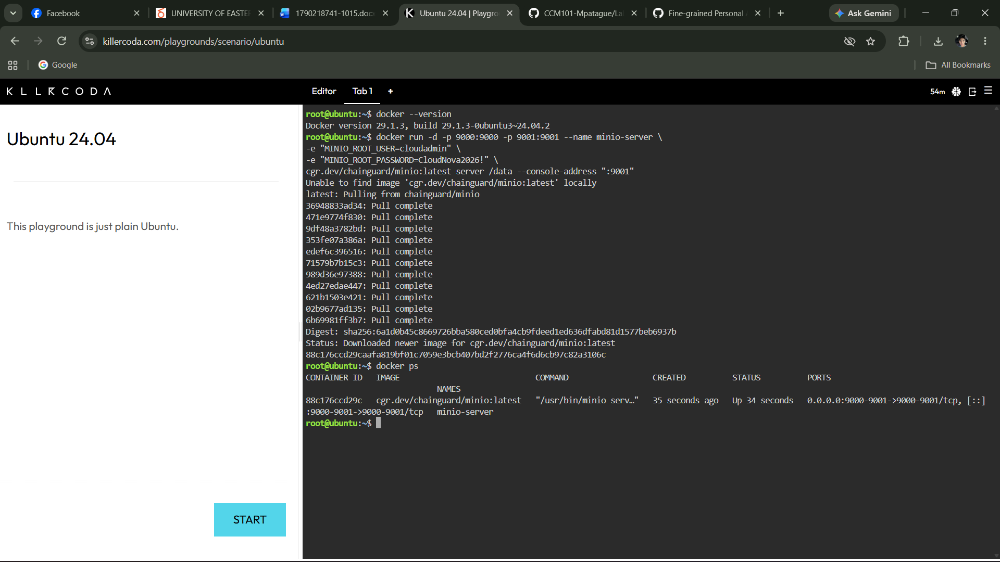
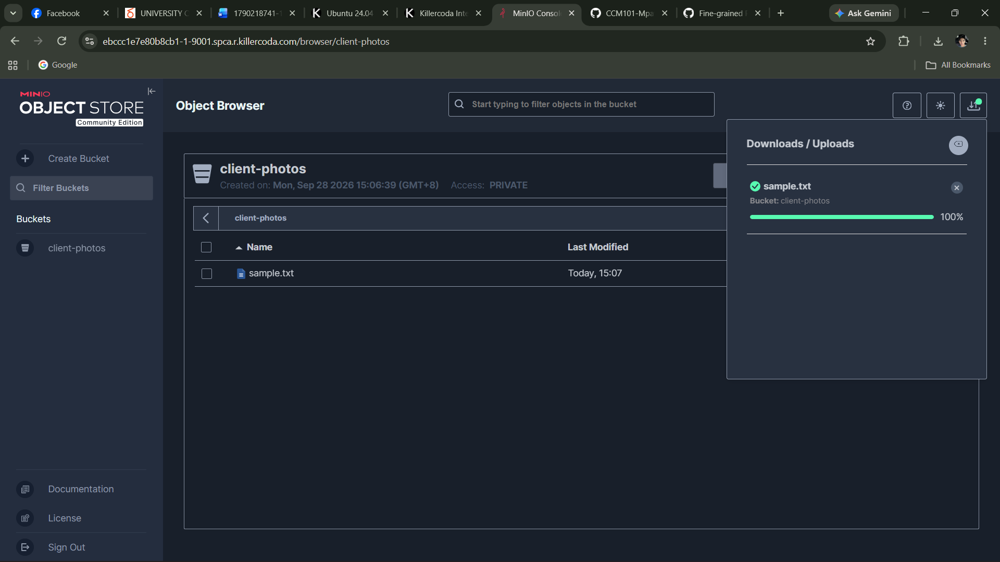

# MinIO Deployment Documentation

## Environment
- Platform: KillerCoda Ubuntu Playground
- Tool: Docker
- Service: MinIO (S3-compatible object storage)

## Docker Command Used

```bash
docker run -d -p 9000:9000 -p 9001:9001 --name minio-server \
  -e "MINIO_ROOT_USER=cloudadmin" \
  -e "MINIO_ROOT_PASSWORD=CloudNova2026!" \
  minio/minio server /data --console-address ":9001"
```

## Verify the Container

```bash
docker ps
```

Screenshot: 

## Deployment Details

| Item | Value |
|---|---|
| Web Console Port | **9001** |
| API Port | 9000 |
| Container Name | minio-server |
| Bucket Created | **client-photos** |

## Steps Taken
1. Launched a KillerCoda Ubuntu Playground.
2. Ran the `docker run` command above to pull and start MinIO.
3. Verified the container was running with `docker ps`.
4. Opened the **Traffic / Ports** tab, entered port **9001**, and clicked **Access**.
5. Logged in with the username `cloudadmin` and the password set in the command.
6. Went to **Buckets → Create Bucket** and created `client-photos`.
7. Opened the bucket and used **Upload** to add a sample file.

Screenshot: 

## What the `-e` Flags Do
The `-e` flag sets **environment variables** inside the container when it starts.
- `MINIO_ROOT_USER=cloudadmin` sets the admin username for MinIO.
- `MINIO_ROOT_PASSWORD=CloudNova2026!` sets the admin password.

Together they define the login credentials for the web console without editing any config files.

## Other Flags
- `-d` runs the container in the background (detached).
- `-p 9000:9000 -p 9001:9001` maps the API and console ports to the host.
- `--name minio-server` gives the container a readable name.
- `--console-address ":9001"` sets the web console port.
